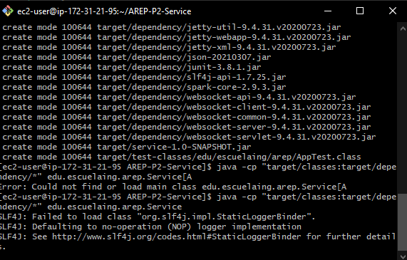
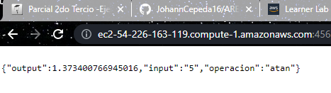
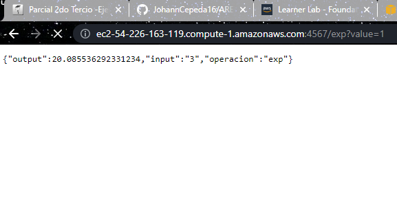

# Proxy
El proxy permite funcionar de intermediario para manejar las peticiones que se hagan desde el navegador. Usando un patron RoundRobin para la asignacion de carga. Para este ejemplo se hizo un patron de "semaforo" aprovechando que solo son dos instancias


### Prerequisitos
Se recomienda contar con las siguientes versiones instaladas:
```
version de java: 15
version de compilador: 1.8
Apache maven: 3.6.3 
```

### Instalación
Para uso del proyecto requerimos clonar este repositorio. Siga los pasos:

1. Clonamos el repositorio con ayuda de git
```
git clone https://github.com/JohannCepeda16/AREP-P2-Service.git
```

2. Accedemos a la carpeta donde hemos clonado
```
cd AREP-P2
```

3. Compilamos nuestro proyecto para generar el target
```
mvn package
```

4. Abrimos el proyecto con nuestro editor de preferencia
```
code .
```
5. Para conectarnos a nuestra maquina virtual usamos la consola y ejecutamos
```
ssh -i "servicesPair.pem" ec2-user@ec2-54-226-163-119.compute-1.amazonaws.com
```

6. y nuestra aplicacion se encuentra en el directorio 
```
cd /home/ec2-user/AREP-P2
```

7. Si queremos ejecutar nuestra aplicacion desde la maquina virtual usamos
```
java -cp "target/classes:target/dependency/*" edu.escuelaing.arep.Service
```

## Imagenes
Aplicacion JAVA corriendo en EC2


Aplicacion JAVA corriendo en EC2


Aplicacion JAVA corriendo en EC2


## Programa hecho con

* [Maven](https://maven.apache.org/) - Dependency Management

## Actor

* **Johann Cepeda** - [johanncepeda16](https://github.com/JohannCepeda16)


## Licencia

This project is licensed under the MIT License - see the [LICENSE.md](LICENSE.txt) file for details

## JavaDoc

La documentación del proyecto la generamos con el siguiente comando 
```
mvn javadoc:javadooc
```
